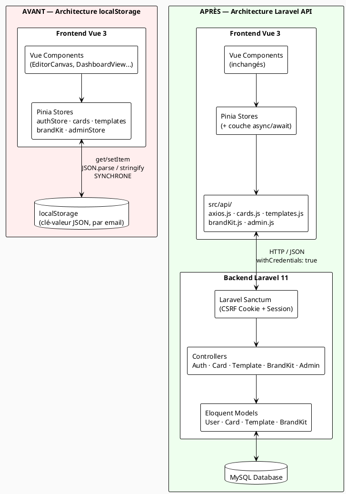
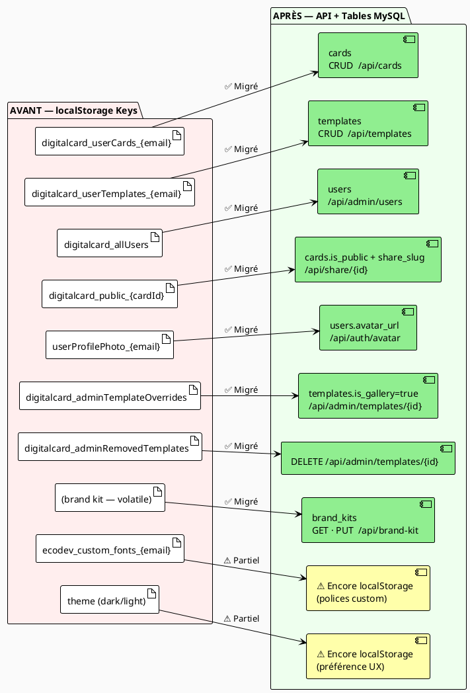
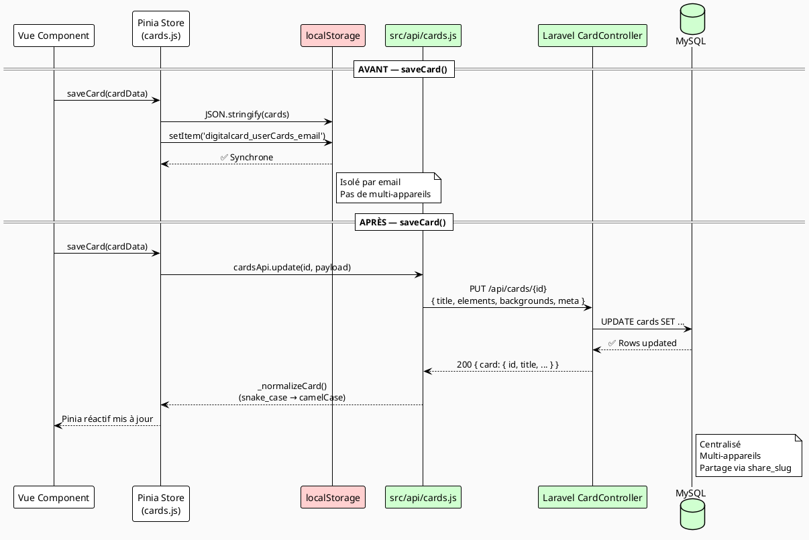
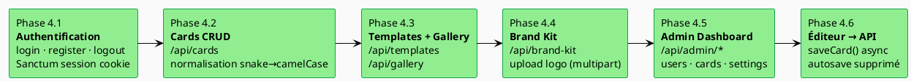
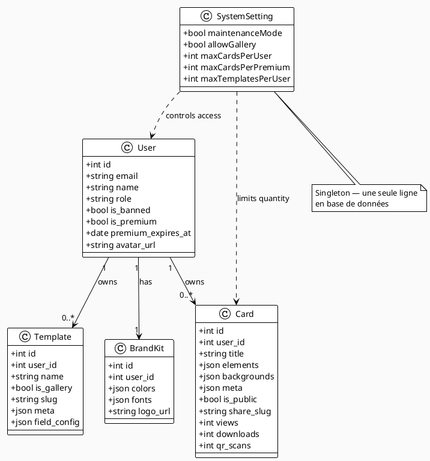

# Diagrammes de Migration — localStorage → Laravel API

Documentation visuelle de la migration de l'architecture de persistance,
du stockage localStorage côté navigateur vers une API REST Laravel 11 + MySQL.

> Coller chaque bloc dans [plantuml.com](https://www.plantuml.com/plantuml/uml/) ou utiliser l'extension VS Code **PlantUML** (Alt+D).

---

## Diagramme 1 — Architecture Avant / Après (Composants)

---

## Diagramme 2 — Correspondance localStorage → API + Tables

---

## Diagramme 3 — Séquence : saveCard() Avant vs Après

---

## Diagramme 4 — Phases de Migration

---

## Diagramme 5 — Classes des Entités Migrées

---

## Tableau récapitulatif — Statut de migration par store

| Store | Fichier | Statut | Endpoint(s) |
|-------|---------|--------|-------------|
| `authStore` | `src/stores/authStore.js` | ✅ Migré | `/api/auth/*` |
| `cardsStore` | `src/stores/cards.js` | ✅ Migré | `/api/cards` |
| `userTemplatesStore` | `src/stores/userTemplatesStore.js` | ✅ Migré | `/api/templates` |
| `brandKit` | `src/stores/brandKit.js` | ✅ Migré | `/api/brand-kit` |
| `adminStore` | `src/stores/adminStore.js` | ✅ Migré | `/api/admin/*` |
| `notificationStore` | `src/stores/notificationStore.js` | ✅ Migré | `/api/notifications` |
| `themeStore` | `src/stores/themeStore.js` | ⚠️ localStorage | — (préférence UX) |
| `fontStore` | `src/stores/fontStore.js` | ⚠️ localStorage | — (fichiers base64) |
| `useEditorStore` | `src/stores/useEditorStore.js` | ⚙️ In-memory | Sauvegardé via `saveCard()` |
