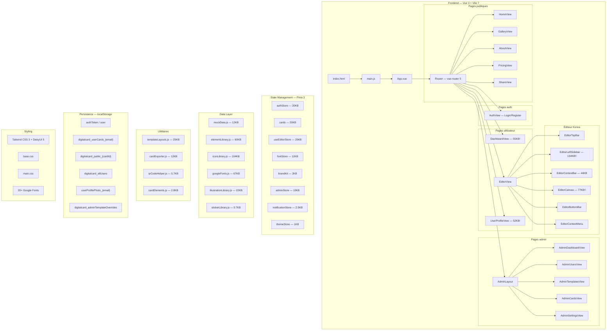

# 🔍 Analyse Complète — ECODEV CARD PRO

## 🎯 Ce que l'app fait

**ECODEV CARD PRO** est une plateforme de **création de cartes de visite numériques** de type "Canva-like", destinée au marché africain (Burkina Faso / zone francophone). Voici ses fonctionnalités principales :

| Module | Description |
|--------|-------------|
| **Éditeur visuel** | Canvas Konva.js pour créer/éditer des cartes de visite (recto/verso) avec texte, formes, images, icônes, QR codes |
| **Templates** | Galerie de templates prédéfinis (gratuits + premium) |
| **Dashboard** | Tableau de bord utilisateur avec stats (vues, téléchargements, scans QR, partages) |
| **Partage** | Système de partage de cartes via lien public + galerie communautaire |
| **Export** | Export PNG et PDF (via `html-to-image` + `jspdf`) |
| **Auth** | Système login/register avec rôles (user/admin) et plan freemium |
| **Admin** | Panel d'administration complet (gestion users, cartes, templates, settings) |
| **Profil** | Page profil utilisateur avec photo, brand kit, polices custom |
| **Pricing** | Page tarification avec plans Free/Premium (via Orange Money / Wave — paiement mobile africain) |

---

## 📐 Architecture Actuelle



### Stack technique résumée

| Couche | Technologie |
|--------|-------------|
| **Framework** | Vue 3.5 (Composition API + `<script setup>`) |
| **Build** | Vite 7.3 |
| **State** | Pinia 3 (8 stores) |
| **Routing** | Vue Router 5 (lazy loading, guards auth/admin) |
| **Canvas** | Konva.js + vue-konva (éditeur graphique) |
| **CSS** | Tailwind CSS 3 + DaisyUI 5 |
| **Export** | html-to-image + jsPDF |
| **QR** | qr-code-styling |
| **Icônes** | Iconify/vue + lucide-vue-next |
| **Fonts** | Google Fonts (20+ familles) + webfontloader |
| **Persistance** | 100% localStorage (aucun backend) |

---

## ✅ Points Forts

### 1. Architecture bien pensée ⭐⭐⭐⭐
- Séparation claire : views / components / stores / utils / data
- Composition API partout (moderne)
- Lazy loading des routes
- Guards d'authentification bien structurés (auth, admin, guestOnly)

### 2. Éditeur très riche ⭐⭐⭐⭐⭐
- Canvas Konva complet (drag, resize, rotate)
- Recto/Verso avec animation de flip
- Undo/Redo (50 niveaux d'historique)
- Grouper/dégrouper, aligner, distribuer
- QR Code avancé (vCard, styles personnalisables)
- 20+ Google Fonts avec chargement dynamique
- Export PNG et PDF multi-page
- Grid, snap, guides de centrage, zone de sécurité
- Raccourcis clavier complets (Ctrl+Z/C/V/D/G/A, flèches, etc.)

### 3. Préparation backend exemplaire ⭐⭐⭐⭐⭐
- Chaque store contient des **TODO backend** précis avec schéma SQL PostgreSQL
- Endpoints API documentés dans les commentaires
- Mentions RGPD, soft-delete, audit log
- Schéma de migration DB clairement défini dans les commentaires

### 4. Fonctionnalités business complètes ⭐⭐⭐⭐
- Modèle freemium (3 cartes gratuites, illimité premium)
- Galerie communautaire (partage public de cartes)
- Admin panel complet (ban, premium toggle, delete)
- Brand Kit (couleurs, polices sauvegardées par utilisateur)
- Système de notifications toast

### 5. Code bien documenté ⭐⭐⭐⭐
- Commentaires en français pertinents
- Docs internes (rapport d'analyse, checklist, diagrammes UML)

---

## ⚠️ Faiblesses & Problèmes Identifiés

### 🔴 CRITIQUES

#### 1. **Fichiers composants GIGANTESQUES** — Maintenabilité 🚨
Les composants de l'éditeur sont beaucoup trop volumineux :

| Fichier | Taille | Problème |
|---------|--------|----------|
| [EditorLeftSidebar.vue](file:///c:/Users/user/digital-card-platform-v2/src/components/editor/EditorLeftSidebar.vue) | **134 KB** | Monster component — devrait être 10+ sous-composants |
| [EditorCanvas.vue](file:///c:/Users/user/digital-card-platform-v2/src/components/editor/EditorCanvas.vue) | **77 KB** | Canvas + rendu + interactions mélangés |
| [DashboardView.vue](file:///c:/Users/user/digital-card-platform-v2/src/views/DashboardView.vue) | **56 KB** | Vue monolithique — doit être décomposée |
| [UserProfileView.vue](file:///c:/Users/user/digital-card-platform-v2/src/views/UserProfileView.vue) | **53 KB** | Idem |
| [EditorContextBar.vue](file:///c:/Users/user/digital-card-platform-v2/src/components/editor/EditorContextBar.vue) | **44 KB** | Un seul composant pour toutes les propriétés |

> **Impact** : Très difficile à maintenir, tester, et débugger. Chaque modification risque des régressions.
> **Recommandation** : Décomposer en sous-composants atomiques (un par onglet, un par panneau de propriétés, etc.)

#### 2. **100% localStorage — Aucun Backend** 🚨
- Toutes les données (users, cartes, photos) vivent dans `localStorage`
- Limite de 5-10 MB selon le navigateur → crash probable avec des images
- Aucune isolation de données entre utilisateurs sur la même machine
- Pas de synchronisation multi-appareil
- Un simple `localStorage.clear()` détruit TOUT

#### 3. **Sécurité inexistante côté client** 🚨
- L'authentification est 100% mock (n'importe quel email/mdp fonctionne)
- Le rôle admin est basé sur un email en dur (`admin@ecodev.dev`)
- Les tokens sont des strings aléatoires sans aucune validation
- Pas de hash de mot de passe (stocké en clair dans localStorage)
- Pas de CSRF, pas de rate limiting

#### 4. **Palettes de couleurs incohérentes** 🚨
- `tailwind.config.js` définit `primary: #e63950` (rouge) — ne correspond PAS à ECODEV (orange #FF8C00)
- 6 palettes custom (primary, secondary, accent, flame, onyx, powder) mais DaisyUI n'est pas configuré avec un thème custom
- Mélange de classes Tailwind brutes et DaisyUI

### 🟡 IMPORTANTS

#### 5. **Données statiques massives embarquées dans le JS**
| Fichier | Taille |
|---------|--------|
| [iconLibrary.js](file:///c:/Users/user/digital-card-platform-v2/src/data/iconLibrary.js) | 104 KB |
| [googleFonts.js](file:///c:/Users/user/digital-card-platform-v2/src/data/googleFonts.js) | 67 KB |
| [elementLibrary.js](file:///c:/Users/user/digital-card-platform-v2/src/data/elementLibrary.js) | 60 KB |

> Tout est importé au build → bundle JS très lourd (~300 KB de données statiques). Devrait être chargé dynamiquement ou via CDN.

#### 6. **Aucun test**
- Pas de tests unitaires, d'intégration, ni e2e
- Framework de test non installé (ni Vitest, ni Cypress, ni Playwright)

#### 7. **Pas de service API / couche HTTP**
- `axios` est installé mais **jamais utilisé** dans le code
- Pas de fichier `services/api.js` — chaque store devra être rewrité individuellement pour le backend

#### 8. **Dark mode géré manuellement**
- Le dark mode utilise des classes conditionnelles manuelles (`themeStore.darkMode ? 'bg-gray-950' : 'bg-gray-100'`) au lieu du `dark:` de Tailwind/DaisyUI
- Duplication massive de styles light/dark dans les `<template>`

#### 9. **Absence de gestion d'erreurs réseau**
- Aucun intercepteur HTTP global
- Pas de retry / timeout
- Pas de mode offline

#### 10. **`/profile` et `/settings` pointent vers le même composant**
- Les deux routes mènent à `UserProfileView.vue` sans distinction — c'est un raccourci qui pourrait confondre les utilisateurs

### 🟢 MINEURS

- Pas de PWA (Service Worker) — pas de fonctionnement offline
- Pas de SEO (vue SPA sans SSR/SSG)
- Pas de lazy loading des librairies de données (icons, fonts, elements)
- `console.log` de debug probablement encore présents
- Documents de specs `.md` et `.docx` dans le dossier `public/` (accessible publiquement)

---

## 📊 Score Global

| Catégorie | Score | Commentaire |
|-----------|-------|-------------|
| **Architecture** | ⭐⭐⭐⭐ (4/5) | Bonne structure mais composants trop monolithiques |
| **Fonctionnalités** | ⭐⭐⭐⭐⭐ (5/5) | Complet pour un MVP frontend |
| **Éditeur** | ⭐⭐⭐⭐⭐ (5/5) | Très impressionnant, proche de Canva basique |
| **Sécurité** | ⭐ (1/5) | Mock total — normal avant backend, mais critique à corriger |
| **Performance** | ⭐⭐⭐ (3/5) | Bundle lourd, composants massifs, pas de code splitting des data |
| **Maintenabilité** | ⭐⭐ (2/5) | Fichiers trop gros, pas de tests |
| **Backend-readiness** | ⭐⭐⭐⭐ (4/5) | Excellents TODO, mais pas de couche API préparée |
| **UI/UX** | ⭐⭐⭐⭐ (4/5) | Bon design, mais thème ECODEV pas appliqué |

**Note globale : 3.5/5** — Un très bon MVP frontend, mais qui nécessite un refactoring structurel avant de scaler.

---

## 🗺️ Arbre des fichiers clés

```
digital-card-platform-v2/
├── index.html                       # Point d'entrée — Google Fonts, titre ECODEV
├── vite.config.js                   # Vite 7 + vue-devtools
├── tailwind.config.js               # Tailwind 3 + DaisyUI (thème custom ABSENT)
├── package.json                     # Vue 3.5, Pinia 3, Konva, jsPDF, qr-code-styling
│
├── src/
│   ├── main.js                      # Bootstrap: Pinia, thème, auth, fonts, brand kit
│   ├── App.vue                      # Layout conditionnel (NavBar/Footer masqués en mode éditeur)
│   │
│   ├── router/index.js              # 12 routes avec guards auth/admin/guestOnly
│   │
│   ├── stores/
│   │   ├── authStore.js             # Auth mock + admin + ban/unban/premium + RGPD TODO
│   │   ├── cards.js                 # CRUD cartes + templates + partage public + admin
│   │   ├── useEditorStore.js        # État éditeur: éléments, history, zoom, pages, sélection
│   │   ├── fontStore.js             # Chargement Google Fonts dynamique
│   │   ├── brandKit.js              # Palettes couleurs/polices par user
│   │   ├── adminStore.js            # Stats admin agrégées
│   │   ├── notificationStore.js     # Toasts notifications
│   │   └── themeStore.js            # Dark mode toggle
│   │
│   ├── components/
│   │   ├── NavBar.vue               # Navigation responsive
│   │   ├── FooterBar.vue            # Footer
│   │   ├── BusinessCard.vue         # Composant preview carte
│   │   ├── ConfirmModal.vue         # Modal de confirmation
│   │   ├── ToastNotification.vue    # Notifications toast
│   │   └── editor/
│   │       ├── EditorTopBar.vue     # Barre d'outils haute (save, export, undo)
│   │       ├── EditorLeftSidebar    # ⚠️ 134KB — Templates, éléments, texte, images...
│   │       ├── EditorCanvas.vue     # ⚠️ 77KB — Canvas Konva principal
│   │       ├── EditorContextBar     # ⚠️ 44KB — Propriétés de l'élément sélectionné
│   │       ├── EditorContextMenu    # Menu clic droit
│   │       └── EditorBottomBar      # Barre basse (zoom, grid, pages)
│   │
│   ├── views/
│   │   ├── HomeView.vue             # Landing page
│   │   ├── AuthView.vue             # Login + Register combinés
│   │   ├── GalleryView.vue          # Galerie templates + communauté
│   │   ├── EditorView.vue           # Vue conteneur de l'éditeur
│   │   ├── DashboardView.vue        # ⚠️ 56KB — Dashboard utilisateur
│   │   ├── UserProfileView.vue      # ⚠️ 53KB — Profil + settings
│   │   ├── ShareView.vue            # Vue partage public d'une carte
│   │   ├── PricingView.vue          # Plans Free/Premium
│   │   ├── AboutView.vue            # À propos
│   │   └── admin/                   # 5 vues admin (dashboard, users, templates, cards, settings)
│   │
│   ├── data/
│   │   ├── mockData.js              # Données mock (templates, users)
│   │   ├── iconLibrary.js           # ⚠️ 104KB — Icônes SVG
│   │   ├── googleFonts.js           # ⚠️ 67KB — Catalogue Google Fonts
│   │   ├── elementLibrary.js        # ⚠️ 60KB — Formes, décorations
│   │   ├── illustrationLibrary.js   # Illustrations SVG
│   │   └── stickerLibrary.js        # Stickers (quasi vide)
│   │
│   ├── utils/
│   │   ├── templateLayouts.js       # Layouts par template pour l'éditeur
│   │   ├── cardExporter.js          # Export PNG/PDF
│   │   ├── qrCodeHelper.js          # Génération QR codes
│   │   └── cardElements.js          # Helpers éléments de carte
│   │
│   ├── layouts/
│   │   └── AdminLayout.vue          # Layout admin (sidebar + content)
│   │
│   └── assets/
│       ├── main.css                 # CSS global
│       ├── base.css                 # Variables CSS
│       └── logo.svg                 # Logo SVG
│
├── public/                          # Assets statiques + docs specs (⚠️ à nettoyer)
└── docs/                            # Diagrammes UML, rapports d'analyse
```

---

## 🚀 Recommandations Prioritaires

### Sprint 1 : Refactoring structure (avant toute nouvelle feature)
1. **Décomposer les composants géants** — EditorLeftSidebar (134KB) en 8-10 sous-composants
2. **Créer une couche API** — `src/services/api.js` avec axios pour préparer le backend
3. **Configurer le thème DaisyUI** avec les couleurs ECODEV (#FF8C00)

### Sprint 2 : Qualité
4. **Ajouter Vitest** + tests unitaires pour les stores critiques
5. **Lazy-load les data** — iconLibrary, fonts, etc. à charger à la demande
6. **Nettoyer le public/** — retirer les .md et .docx de specs du build

### Sprint 3 : Backend
7. **Développer l'API backend** (Node.js/Express ou Laravel)
8. **Remplacer localStorage** par des appels HTTP
9. **Implémenter une vraie auth** (JWT + bcrypt)
